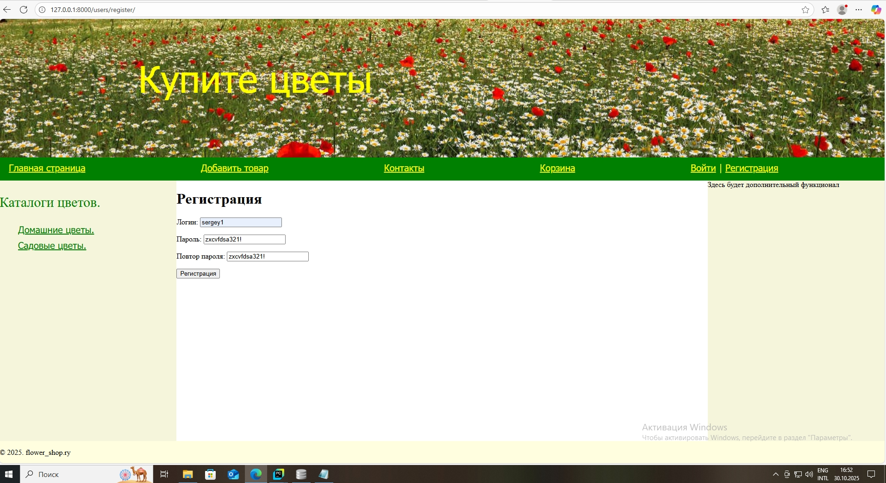
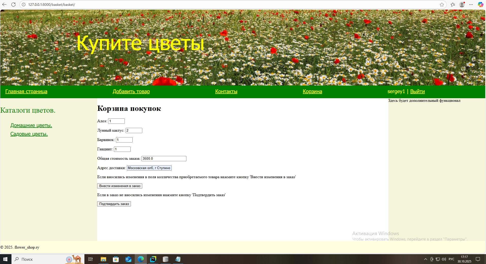
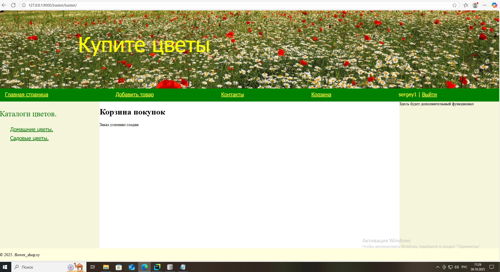

# DjangoWebSite
В проекте реализован интернет-магазин flower_shop.

# Основной функционал:
1. Создание веб страницы в сети интернет.
2. Представление товара магазина, обработка и формирование заказа.

# Работа приложения.

1. Для запуска сайта необходимо в командной строке в корневом каталоге flower_shop выполнить python manage.py runserver.
2. Запустить браузер и перейти на страницу http://127.0.0.1:8000

3. Для просмотра товара необходимо перейти по сыллке каталога товара(например Садовые цветы)

4. Более подробную информацию о товаре можно получить нажав на фотографию товара и перейти на его персональную страницу.

5. Покупка товара возможна только зарегистрированным покупателем. Для приобретения товара нужно нажать кнопку "Купить" либо на странице каталога, либо на персональной странице товара, после чего он будет направлен в корзину покупателя.
При нажатии на кнопку "Купить" незарегистрированный покупатель будет перенаправлен на страницу регистрации.
6. Для регистрации покупателю необходимо в форме регистрации заполнить поле "Логин" и поля  "Пароль" и "Повтор пароля"

После прохождения процедуры регистрации покупатель будет перенаправлен на страницу авторизации, где в в поля соответствующей формы необходимо заполнить поле "Логин" и поле  "Пароль". При правильной авторизации покупатель будет перенаправлен на главную стпаницу для просмотра сайта и совершения покупок.

7. После выбора товара покупатель может перейти в "Корзину" для оформления заказа.

При необходимости можно откорректировать колличество товара изменив его в поле ввода, если установить значение на 0 товар будет удален из заказа.

При коректировке заказа необходимо нажать кнопку "Внести изменение в заказ", форма заказа обновится.

Завершается формирование заказа нажатием кнопки "Подтвердить заказ", после чего заказ будет занесен в базу данных.

8. Для внесения в базу данных товара необходимо перейти по ссылке "Добавить товар". Данная возможность предусмотрена только для суперпользователя "admin".
После перехода по ссылке на страницу в форму заносятся необходимые сведения и нажатием кнопки "Загрузить в базу" осуществляется отправка  в базу данных. 

[Видео демонстрации работы сайта](screenshot/2025-11-07%2012-45-53.mp4 "Видео демонстрации работы сайта")
# Структура проекта.

В проект входят следующие файлы и каталоги:
1. Корневой каталог flower_shop.
2. Каталог основного приложения проекта Flower.
3. Каталог приложения Basket- обрабатывает и расчитывает стоимость заказа и заносит заказ в базу данных .
4. Каталог приложения Users- выполняет регистрацию и авторизацию покупателей магазина.
5. Каталог Media- хранятся графические изображения.
6. Каталог Templates- содержит файл base.html.
7. База данных db.sqlite3
8. Файл manager.py.
9. .gitignor. 
10. README.md 
11. Каталог screenshot- хранятся скриншоты для файла README.md 
12. requirements.txt

# Дополнительные условия.

1. Для входа в интернет-магазин можно воспользоваться логином и паролем:
администратор - admin 12345
обычный пользователь - sergey1 qazxsw123!
