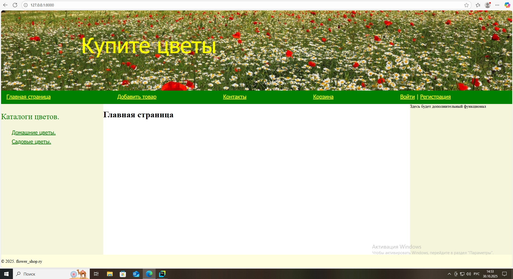
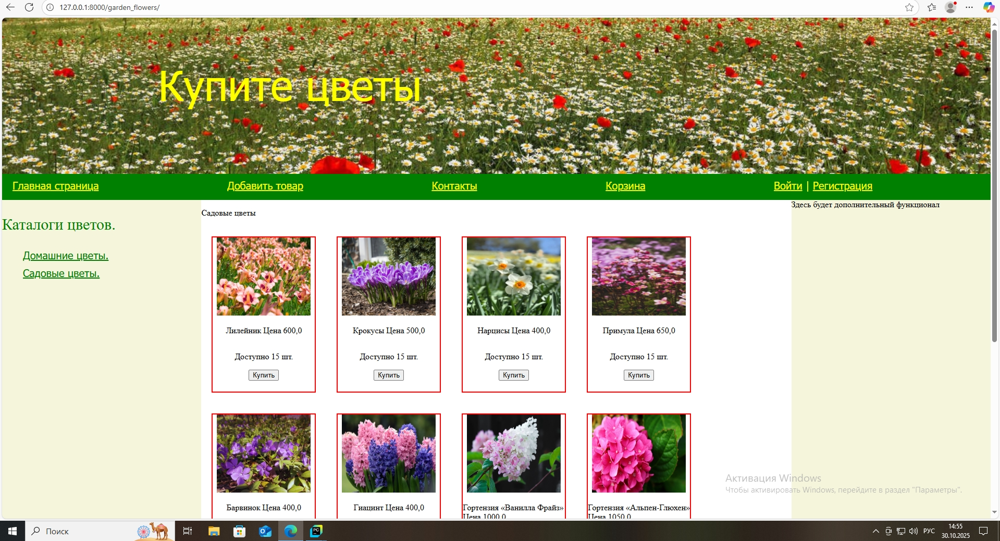
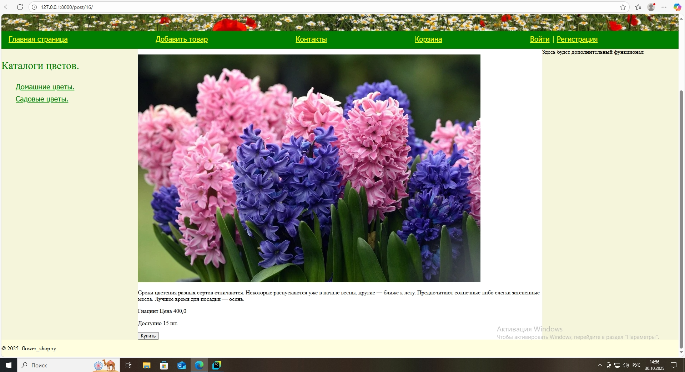

# DjangoWebSite
В проекте реализован интернет-магазин flower_shop.

# Основной функционал:
1. Создание веб страницы в сети интернет.
2. Представление товара магазина, обработка и формирование заказа.

# Работа приложения.

1. Для запуска сайта необходимо в командной строке в корневом каталоге flower_shop выполнить python manage.py runserver.
2. Запустить браузер и перейти на страницу http://127.0.0.1:8000

3. Для просмотра товара необходимо перейти по сыллке каталога товара(например Садовые цветы)

4. Боелее подробную информацию о товаре можно получить нажав на фотографию товара и перейти на его персональную страницу.

5. Покупка товара возможна только зарегистрированным покупателе. Для приобретения товара нужно нажать кнопку "Купить" либо на странице каталога, либо на персональной странице товара, после чего он будет направлен в корзину покупателя.
При нажатии на кнопку "Купить" незарегистрированный покупатель будет перенаправлен на страницу регистрации. 

# Структура проекта.

В проект входят следующие файлы и каталоги:
1. Корневой каталог flower_shop.
2. Каталог основного приложения проекта Flower.
3. Каталог приложения Basket- обрабатывает и расчитывает стоимость заказа и заносит заказ в базу данных .
4. Каталог приложения Users- выполняет регистрацию и авторизацию покупателей магазина.
5. Каталог Media- хронятся графические изображения.
6. Каталог Templates- содержит файл base.html.
7. База данных db.sqlite3
8. Файл manager.py.
9. .gitignor. 
10. README.md 
11. Каталог screenshot- хранятся скриншоты для файла README.md 
12. requirements.txt

# Дополнительные условия.

1. Для входа в интернет-магазин можно воспользоваться логином и паролем:
администратор - admin 12345
обычный пользователь - sergey1 qazxsw123!
